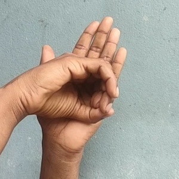
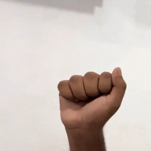
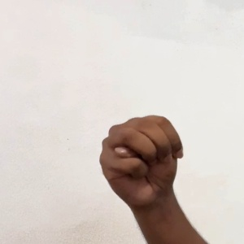
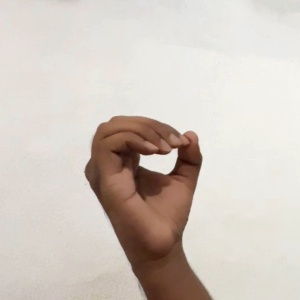

```{python}
# | tags: [parameters]
run_dir = "runs/aslbench-20260713-203909"
output_fmt = "html"
```

```{python}
import json
import os
from pathlib import Path

import pandas as pd
from IPython.display import HTML, Image, Markdown, display

from aslbench import figures, runner, scoring

run_dir = Path(run_dir).resolve()
run_slug = run_dir.name
config_data = json.loads((run_dir / "config.json").read_text())
results = runner.model_results_list(run_slug)
nonempty = [result for result in results if not result.df.empty]
labels = [result.model_label for result in nonempty]
colors = figures.assign_colors(labels)

quarto_format = os.environ.get("QUARTO_PROJECT_OUTPUT_FORMAT", "").lower()
_OUTPUT_FMT = "typst" if "typst" in quarto_format else output_fmt


def _show_fig(fig):
    """Render Plotly interactively for HTML and as PNG for Typst."""
    if _OUTPUT_FMT == "html":
        fig.show()
    else:
        import plotly.io as pio

        fig_height = fig.layout.height or 500
        img_bytes = pio.to_image(fig, format="png", width=900, height=fig_height)
        display(Image(img_bytes))


def _show_table(df: pd.DataFrame) -> None:
    """Render tables in the form best suited to each output format."""
    if _OUTPUT_FMT == "html":
        display(HTML(df.to_html(index=False)))
    else:
        display(Markdown(df.to_markdown(index=False)))


def _fmt_table(df: pd.DataFrame) -> pd.DataFrame:
    """Format floats, booleans, and missing values for display."""
    out = df.copy()
    for column in out.select_dtypes(include="float").columns:
        out[column] = out[column].apply(
            lambda value: f"{value:.3f}" if pd.notna(value) else "not available"
        )
    for column in out.select_dtypes(include="bool").columns:
        out[column] = out[column].apply(lambda value: "yes" if value else "no")
    return out
```

# Executive summary

**aslbench** is a novel, interactive benchmark of fine-grained visual perception in frontier vision language models. It presents a model with a photograph from the ASL-HG dataset ([Pranto et al., 2026](https://data.mendeley.com/datasets/j4y5w2c8w9/1)) and asks it to identify one of 36 American Sign Language fingerspelling characters, digits 0 to 9 or letters A to Z. Predictions are parsed under a fixed response contract and scored by exact match against the dataset label. No human or model judge participates in scoring.

The definitive evaluation tested four frontier models on the same balanced set of 360 images. Accuracy ranged from **31.7% to 56.1%**, compared with a **2.8% random-choice baseline**. The best model, `gpt-5.6-sol`, correctly classified 202 images. Every model was meaningfully above chance and meaningfully below perfect, so the benchmark is neither trivial nor saturated. Exact paired McNemar tests found every pairwise accuracy difference significant after Holm correction at the 0.05 level.

The results show a substantial gap between broad visual competence and precise handshape recognition. Models handled distinctive static shapes such as `V`, `4`, and `5` well, but all four failed every sampled `J`, `M`, `N`, and `Z`. Some errors reveal visual limitations, such as repeated confusion among compact fist-like shapes. Others expose limits in the benchmark itself, particularly motion-defined letters and character pairs whose still-image handshapes overlap.

# What the benchmark measures

## Task and capability

Each item contains one photograph of one or two hands forming a labeled character. The model must infer the character from subtle visual evidence:

* which fingers are extended, curled, crossed, or tucked;
* the thumb's position relative to the fingers;
* palm orientation and viewpoint;
* occlusion among fingers;
* whether one or two hands are present.

This is a demanding case of fine-grained visual classification. The high-level object, a hand, remains almost constant across all 36 labels. The information that matters is concentrated in small, articulated structures that frequently overlap. Image resizing can remove useful detail, and a two-dimensional photograph can make depth relationships ambiguous. General-purpose VLM training data also contains far fewer carefully labeled hand configurations than common objects, scenes, and text. These conditions make fingers a persistent weak point for image generation and image understanding systems.

The capability matters beyond this dataset. Reliable hand and gesture perception is relevant to accessible interfaces, human-computer interaction, robotics, safety monitoring, and sign-language technology. A model that recognizes a person and the surrounding scene but misses the exact hand configuration has not fully understood the image.

## Why this benchmark is novel

`aslbench` defines a new evaluation of general-purpose frontier VLMs. Prior fingerspelling research has largely trained specialized computer-vision classifiers for sign recognition. To my knowledge after reviewing the available task and dataset literature, no published benchmark has compared frontier general-purpose VLMs on this exact 36-way ASL-HG task.

The novel question is: can an off-the-shelf frontier VLM, prompted through its normal multimodal interface and without task-specific training, resolve these handshapes? The source images are public, but the model comparison, prompts, paired sampling design, interactive runner, and statistical reporting are new.

## How the deliverable satisfies the requirements

**Novel.** The benchmark targets a new model and dataset combination, with a purpose-built protocol for frontier VLMs. It does not call or repackage another benchmark. It tests fine-grained handshape perception directly.

**Non-saturated.** The definitive scores span 31.7% to 56.1%. All models beat the 2.8% chance baseline by a wide margin, while the best model still misses 158 of 360 items. The task therefore has room both to distinguish current models and to measure future progress.

**Reproducible.** The repository records the processed-dataset seed, definitive run seed, exact sampled item identifiers, prompt template, provider and model identifiers, package version, per-item responses, predictions, errors, and summaries. Every model in a run sees the identical images. The conda environment, provider configuration, tests, and Quarto export path are documented. A second evaluator can rebuild the dataset and obtain a comparable run, while the archived artifacts permit exact reanalysis of this run without making new API calls.

**Quantitatively scored.** Exact-match accuracy is the primary metric. Macro F1, bootstrap confidence intervals, normalized confusion matrices, class-level results, and exact paired significance tests provide complementary quantitative views. Parse failures and provider failures are tracked separately, so operational errors cannot disappear into the model score.

**Interactive.** The Dash application lets an evaluator choose subset size, prompt, and one or more provider-backed models; monitor progress; stop a run; compare results; inspect each image and raw response; manage run history; and export self-contained HTML or PDF reports.

# Dataset and examples

ASL-HG contains 36 classes, 10 participants, and 1,000 source images per class. The photographs were captured by smartphone in natural indoor and outdoor settings. The repository's processed subset contains 3,600 images, with 10 seeded images retained per participant and class. The definitive run sampled 10 images per class from that processed set.

The following examples were all included in the definitive run, and are broadly representative of the images the models are presented with.

::: {layout-ncol=4}
{fig-alt="Two hands forming a closed ring for the ASL-HG digit zero"}

{fig-alt="A hand forming the ASL letter A"}

{fig-alt="A hand forming the ASL letter M"}

{fig-alt="A hand forming the ASL letter O"}
:::

These particular examples expose real model differences. Three models recognized the shown `0`; `claude-sonnet-4.6` predicted `9`. Three recognized the shown `A`; `claude-opus-4.8` predicted `S`. No model recognized the shown `M`. Three recognized the shown `O`; `claude-sonnet-4.6` predicted `F`.

# Methodology

## Dataset construction and sampling

The script `scripts/subset_dataset.py` creates the processed set from the public raw ASL-HG download. It samples 10 images for every participant within every class using seed `20260711`, yielding 3,600 images with exact class and participant balance. The source folder is the authoritative class label.

At run time, the human evaluator chooses 1 to 10 images per class. There is no default selection. The runner samples without replacement using a newly generated seed and archives the selected item identifiers. Every selected model receives the same ordered item set, which makes cross-model comparisons paired rather than independent. The definitive run used the maximum UI setting of 10 images per class, for 360 total evaluations per model.

The filename encodes the answer, so leakage prevention is part of the benchmark design. OpenAI-compatible and Anthropic providers receive image bytes inline. The Copilot provider copies each image to a temporary neutral filename before attachment, disables tools, runs a single-item session, then destroys the session and temporary file. The model does not have access to any file names.

## Prompt templates

The project includes three prompt templates of escalating complexity:

1. **`v1_zeroshot`** states the task and response format with minimal guidance. It measures performance under the least scaffolding.
2. **`v2_class_list`** lists all 36 valid outputs, directs attention to finger, thumb, palm, and hand-count evidence, and explains the dataset's one-handed `O` versus two-handed `0` distinction.
3. **`v3_reasoning`** adds a five-step visual analysis procedure.

The definitive benchmark used **`v2_class_list`**. It is the best middle condition for a model comparison: more controlled than the minimal prompt, but less interventionist than mandatory step-by-step reasoning. The task is perception, so the final protocol supplies the label ontology and known dataset convention while leaving the model's internal decision process unconstrained. All templates require the final line `ANSWER: <single character>`.

## Model execution

The provider abstraction supports GitHub Copilot, Anthropic, OpenAI-compatible cloud APIs, and local OpenAI-compatible servers such as LM Studio or oMLX. Each model executes in its own background thread, while items remain sequential within a model. Responses, optional thinking text, latency, token counts, parse status, and provider errors are written incrementally. Atomic state files support progress polling and post-interruption recovery.

The definitive run compared the following models:

* `gpt-5.6-sol`
* `gpt-5.6-terra`
* `claude-opus-4.8`
* `claude-sonnet-4.6`

All 1,440 calls completed. Every response parsed successfully, and no provider errors occurred.

## Scoring and statistical design

The parser prefers the last valid `ANSWER: X` line and permits a bare single-character fallback. Letters are normalized to uppercase. An invalid or missing answer is incorrect and is also counted as a parse failure.

The primary metric is accuracy:

$$
\mathrm{accuracy} = \frac{\text{correct predictions}}{\text{evaluated images}}.
$$

Macro F1 gives each class equal weight, then combines class precision and recall. This matters even in a balanced run because a model may overpredict a few familiar labels. Accuracy and macro F1 receive deterministic 95% percentile bootstrap intervals from 1,000 item-level resamples.

Confusion matrices are normalized within each true class, making the diagonal equal to per-class recall. Pairwise model differences use exact two-sided McNemar tests on the shared items. Holm correction controls family-wise error across all six model pairs. This paired test is more appropriate than comparing independent confidence intervals because every model saw exactly the same images.

# Delivery process and implementation choices

I used an iterative, model-assisted engineering workflow, with each model serving a different role and with human audit between stages.

1. I developed the benchmark concept independently, then specified the problem, constraints, and assessment requirements in `BRIEF.md`.
2. I gave that brief to Fable 5 to produce the detailed architecture in `PLAN.md`. I audited and refined the plan before implementation, especially around provider abstraction, filename leakage, long-running Dash work, reproducible sampling, and Quarto-powered reporting.
3. I used Opus 4.8 to implement the first working version across the dataset, providers, runner, scoring, application, tests, and report layers.
4. After reviewing comparable benchmarks in the literature, I refined the included metrics and figures. The finished product intentionally differs from the initial plan in that it presents a smaller subset of statistics and charts which are more focused on head-to-head comparisons of overall model performance on the task, rather than more fine-grained details.
5. I used Sonnet 4.6 to refine the UI, make targeted app behavior changes, and assist in auditing the codebase.

Important deviations from the plan include a chance baseline, macro F1 confidence intervals, exact paired McNemar tests with Holm correction, and per-class difference plots sorted by model advantage. These additions make effect size, uncertainty, and pairwise differentiation easier to interpret.

The architecture retained the plan's most important boundaries. Benchmark logic lives in importable Python modules rather than callbacks or shell scripts. The app also calls the same dataset, runner, scoring, and figure functions used by tests and reports. Run folders are durable intermediates, and Quarto renders those artifacts into reports without rerunning the benchmark.

# Definitive results

## Overall performance

| Model | Correct | Accuracy | 95% accuracy CI | Macro F1 | 95% macro F1 CI |
|---|---:|---:|---:|---:|---:|
| `gpt-5.6-sol` | 202 / 360 | 0.561 | 0.511 to 0.611 | 0.517 | 0.468 to 0.549 |
| `gpt-5.6-terra` | 163 / 360 | 0.453 | 0.400 to 0.506 | 0.386 | 0.343 to 0.413 |
| `claude-opus-4.8` | 143 / 360 | 0.397 | 0.350 to 0.444 | 0.355 | 0.309 to 0.385 |
| `claude-sonnet-4.6` | 114 / 360 | 0.317 | 0.269 to 0.367 | 0.249 | 0.213 to 0.271 |
| Uniform random choice | about 10 / 360 | 0.028 | not applicable | 0.028 | not applicable |

```{python}
_show_fig(figures.accuracy_bar(nonempty, colors))
```

The ranking is consistent across accuracy and macro F1. Macro F1 is lower than accuracy for every model, especially `claude-sonnet-4.6`. This indicates that aggregate correctness is supported by strong performance on a subset of labels rather than uniform competence across the alphabet and digits.

Every paired difference is significant after Holm correction. The closest comparison is `gpt-5.6-terra` versus `claude-opus-4.8`; the adjusted value is 0.0446, with 55 shared images won only by Terra and 35 won only by Opus. The strongest model, `gpt-5.6-sol`, beats Terra on 67 discordant items while losing 28, and the adjusted value is 0.000234.

## Class-level pattern

Across models, the easiest labels were `V` at 97.5% mean accuracy, `4` and `5` at 90.0%, and `Y` at 85.0%. The hardest were `J`, `M`, `N`, and `Z`, all at 0%. The labels `2` and `9` averaged 2.5%, while `K` also averaged 2.5%.

The errors are highly structured:

* `2` was read as `V` 9 or 10 times by every model. This is evidence of visual or label ambiguity, not random noise.
* `J` was read as `I` on all 10 images by both GPT variants; the still image omits the motion that distinguishes `J`.
* `M` and `N` were usually collapsed into `S`, reflecting difficulty resolving hidden thumb placement and finger overlap in compact handshapes.
* `K` was read as `V` 7 to 10 times, which suggests difficulty detecting the thumb's contact and depth relationship.
* `E` was frequently read as `S`, another compact-shape confusion.
* `P` was frequently read as `G`, consistent with an orientation-dependent distinction.

```{python}
diff_fig = figures.per_class_diff_bars(nonempty, colors)
if diff_fig is not None:
    _show_fig(diff_fig)
```

## Capability interpretation

**The benchmark measures more than generic image understanding.** All models are far above chance, showing that they possess meaningful ASL handshape knowledge and can apply it to unfamiliar photographs. Yet no model exceeds 57%, showing that this knowledge does not translate into robust fine-detail perception.

**Model scale or family alone does not determine the error pattern.** The four models differ substantially in aggregate score, but they share several dominant confusions. Shared failures on `M`, `N`, `J`, and `Z` point to common representational or task-level constraints. Model-specific differences, such as Sonnet's 90% on `1` while Terra scores 0%, show that the benchmark also detects genuinely different class profiles.

**Static spatial cues and motion cues separate cleanly.** Distinctive static configurations such as `V`, `4`, and `5` are strong. Motion-defined `J` and `Z` are universally wrong. That contrast is a useful diagnostic, but it also marks a boundary on what a single-frame benchmark can validly claim.

# Limitations and improvements

## Ecological validity

Fingerspelling still images are not an ecologically complete representation of ASL. ASL users communicate through continuous movement: facial expression, body position, spatial grammar, and transitions between signs. Fingerspelling is one component of the language, not ASL as a whole. A video benchmark would better reflect actual communication and would correctly represent movement-dependent letters such as `J` and `Z`.

I consciously chose not use video because it would be disproportionately expensive for this assessment.

## Label identifiability

Some nominally different characters share or nearly share a static handshape. The near-universal `2` to `V` confusion is the clearest example. `J` and `Z` are defined partly by motion. Treating these cases as ordinary 36-way image errors can understate actual visual competence. A revised benchmark should annotate whether each class is statically identifiable.

## Dataset scope and generalization

ASL-HG contains 10 volunteers from one collection context in Dhaka, Bangladesh. Its natural backgrounds are useful, but one dataset cannot establish performance across cameras, signing styles, left-handed signers, age groups, disabilities, and regions. Participant-level accuracy variation in this run also suggests sensitivity to signer or capture conditions. Replication on independently collected datasets would strengthen external validity.

## Prompt and model coverage

The definitive run fixes one prompt, one provider path, and four models. That controls comparison, but it does not measure prompt sensitivity and excludes many frontier models. A fuller study would run all three prompts on a wider variety of models.

## Benchmark integrity

The dataset is recent (within six months), which substantially lowers but does not eliminate contamination risk. An improved version would use a private or newly collected dataset.

# Conclusion

`aslbench` turns a recognizable VLM weakness into a reproducible, quantitative, and interactive evaluation. Its definitive run clearly differentiates four frontier models, with scores well above chance and well below perfect. While the results showed a clear stratification in overall performance by frontier models on the task, it also showed a strikingly consistent pattern of success and failure across specific handshapes.

The benchmark also demonstrates the value of error analysis in benchmark design. Universal failures on movement-defined or visually overlapping labels are findings about both the models and the measurement instrument.

\newpage

# Appendix: Definitive Run Detail {#sec-definitive-run}

This appendix is the detailed run report for `aslbench-20260713-203909`. It is generated from the archived configuration and per-item result files using the same scoring and figure functions as the interactive application.

## Run metadata

```{python}
metadata_lines = [
    f"* **Run:** {config_data['run_slug']}",
    f"* **Started:** {config_data['started_at']}",
    f"* **Images per class:** {config_data.get('n_per_class')}",
    f"* **Classes:** {config_data.get('n_classes')}",
    f"* **Total images:** {config_data['n_items']}",
    f"* **Sample seed:** {config_data['sample_seed']}",
    f"* **Prompt template:** {config_data['template_id']}",
    f"* **Note:** {config_data.get('run_note') or '(none)'}",
]
display(Markdown("\n".join(metadata_lines)))
```

```{python}
model_rows = [
    {
        "Provider": model["provider_label"],
        "Model": model["model_label"],
        "Slug": model["model_slug"],
    }
    for model in config_data["models"]
]
_show_table(pd.DataFrame(model_rows))
```

The task is 36-way single-character classification. Every model saw the identical sampled images, so model comparisons are paired. Filenames, which encode the true class, were never shown to the models.

## Full comparison

```{python}
if nonempty:
    _show_table(_fmt_table(scoring.comparison_table(nonempty)))
else:
    display(Markdown("No results recorded."))
```

* **Accuracy:** the share of images labeled correctly.
* **Macro F1:** the class-balanced harmonic mean of precision and recall.
* **Parse failure rate:** the share of replies that could not be read as one valid character.
* **Provider error rate:** the share of calls that returned no usable model response.
* **Chance:** the expected score from uniform random choice among 36 labels.

```{python}
if nonempty:
    _show_fig(figures.accuracy_bar(nonempty, colors))
```

```{python}
appendix_diff_fig = figures.per_class_diff_bars(nonempty, colors)
if appendix_diff_fig is not None:
    _show_fig(appendix_diff_fig)
```

## Confusion matrices

```{python}
if nonempty:
    _show_fig(figures.confusion_heatmaps(nonempty, colors))
```

Each row is a true character and each column is the prediction. Values are normalized within true character, so diagonal cells show recall and bright off-diagonal cells show systematic confusions.

## Paired significance tests

```{python}
if len(nonempty) >= 2:
    mcnemar = scoring.mcnemar_table(nonempty)
    if not mcnemar.empty:
        mcnemar_display = _fmt_table(mcnemar).rename(
            columns={
                "model_a": "Model A",
                "model_b": "Model B",
                "better": "Better",
                "only_a_correct": "A only",
                "only_b_correct": "B only",
                "n_discordant": "Discordant",
                "p_value": "p",
                "p_holm": "p (Holm)",
                "significant": "Significant",
            }
        )
        _show_table(mcnemar_display)
```

The exact two-sided McNemar test uses only discordant images, where one model is correct and the other is wrong. `p (Holm)` adjusts across every pairwise comparison. A result is significant when the adjusted value is below 0.05.

## Per-model error detail

```{python}
for result in nonempty:
    display(Markdown(f"### {result.model_label}"))

    confused = scoring.most_confused(result.df, top_n=8).rename(
        columns={"true_char": "True", "pred_char": "Predicted", "count": "Count"}
    )
    wrong = result.df[(result.df["parse_ok"]) & (~result.df["correct"])].head(8)
    wrong = wrong[["item_id", "true_char", "predicted_char"]].rename(
        columns={
            "item_id": "Item",
            "true_char": "True",
            "predicted_char": "Predicted",
        }
    )

    if not confused.empty:
        display(Markdown("**Most-confused pairs**"))
        _show_table(confused)
    if not wrong.empty:
        display(Markdown("**Sample misclassifications**"))
        _show_table(wrong)
```
